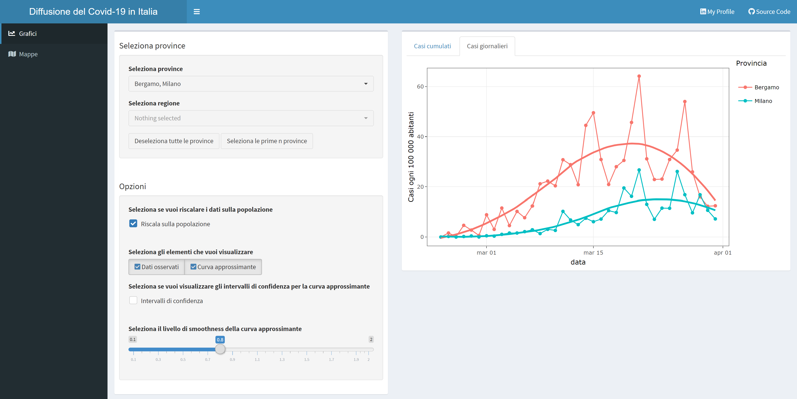

# Covid-19 in Italy with R Shiny

## App description

With this web app you can explore the Covid-19 spreading in Italy. The whole app has been made with [R Shiny](https://shiny.rstudio.com/).

[You can run it from here](https://stinco.shinyapps.io/covid19itaprov/).

## Project description

The file `app.R` contains all the code that runs the app.

## Data

The Covid-19 italian data comes from the [official GitHub repository made by the Protezione Civile](https://github.com/pcm-dpc/COVID-19).

